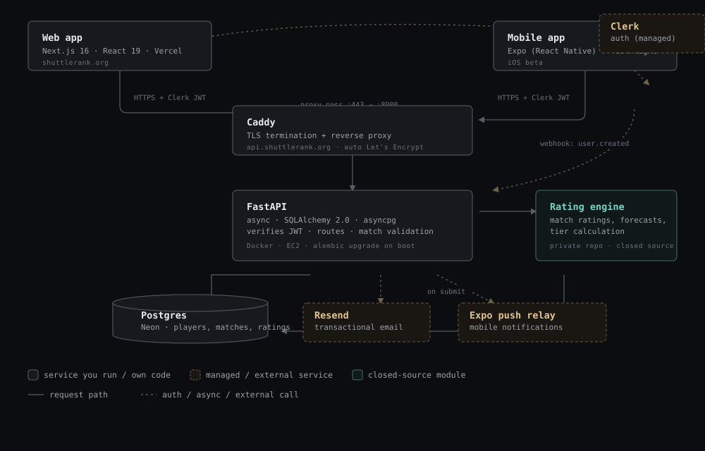

# ShuttleRank

A badminton rating system built for **New Jersey badminton club members** — find where you rank, track your matches, and climb the club ladder.

Ratings are computed by a Glicko-2–based engine (uncertainty-aware, tuned for casual match volume) that also factors in how decisively a match was won, not just who won. The engine itself is closed-source — it's the project's core differentiator — everything else here is open.

Support for badminton clubs across the United States is planned.

**Try it:** [shuttlerank.org](https://shuttlerank.org) · iOS app in beta

---

## What it does

- **Match submission & validation** — anyone can record a match, but it only affects ratings once every participant confirms it. Disputes block the rating update.
- **Singles & doubles ratings** — tracked independently per player, on a 1.0–5.0 casual scale with tiered labels (Bronze → Diamond).
- **Pre-match forecast** — win-probability estimate before you play.
- **Leaderboard** — per category, filterable by minimum matches played.
- **Match history** — full record with per-match rating deltas.
- **Tournaments** — structured events with sanctioned-match weighting.
- **Notifications** — email + push when a match needs your approval.

## How it's put together




**You run** (one EC2 box, Docker Compose):
- **Caddy** — the only thing exposed to the internet; terminates TLS, reverse-proxies to the API.
- **FastAPI** — verifies the Clerk JWT on every request, runs business logic, calls the rating engine, reads/writes Postgres. Migrations apply automatically on deploy.

**You rent** (managed):
- **Postgres (Neon)** — source of truth.
- **Clerk** — auth (Google OAuth + email/password); a webhook syncs new users into the app.
- **Vercel** — hosts the web app, auto-deploys on push to `main`.
- **Expo/EAS** — builds the iOS app and relays push notifications.
- **Resend** — transactional email.

## Repo layout

```
badminton_rating/
├── api/          FastAPI app — routes, auth, serializers
├── db/           SQLAlchemy models + Alembic migrations
├── services/     match validation, notifications, email, push
└── engine/       rating engine (private submodule, not in this repo)
frontend/         Next.js web app
mobile/           Expo (React Native) iOS/Android app
tests/            pytest — API + service layer
```

## Tech stack

| Layer | Choice |
|---|---|
| API | Python · FastAPI · SQLAlchemy 2.0 (async) · Alembic |
| Database | PostgreSQL (Neon) |
| Web | Next.js · React 19 · Tailwind · shadcn |
| Mobile | Expo (React Native) |
| Auth | Clerk |
| Infra | Docker Compose · Caddy · AWS EC2 · Vercel |

---

© 2026 Andrew Xiao. All rights reserved.
